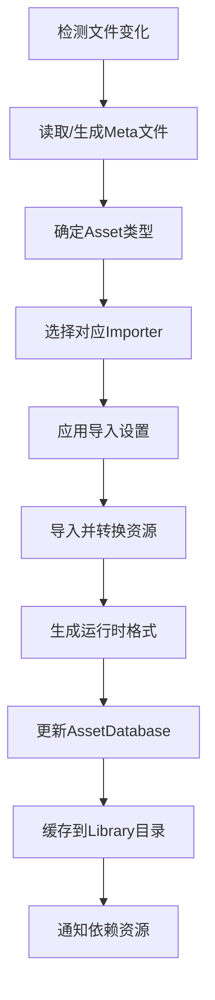

# SoulEngine 资源系统设计文档

## 1. 概述

SoulEngine 资源系统设计参考现代游戏引擎（如 Unity、Unreal）的资源管理机制，提供高效、灵活的资源加载和管理功能。

### 设计目标
- **自动化导入**：类似 Unity 的资源导入管道
- **元数据管理**：每个资源生成对应的 .meta 文件
- **类型安全**：强类型资源系统
- **异步加载**：支持后台资源加载
- **内存管理**：智能引用计数和生命周期管理
- **热重载**：开发时支持资源热重载
- **跨平台**：统一的资源格式和加载机制

## 2. 系统架构

```
┌─────────────────────────────────────────────────────────────┐
│                    Resource System                          │
├─────────────────┬─────────────────┬─────────────────────────┤
│  Resource       │   Asset         │    Meta Data            │
│  Manager        │   Database      │    System               │
│                 │                 │                         │
│ • Loading       │ • Asset Registry│ • .meta files          │
│ • Caching       │ • GUID System   │ • Import Settings      │
│ • Reference     │ • Dependencies  │ • Asset Properties     │
│   Counting      │                 │                         │
├─────────────────┼─────────────────┼─────────────────────────┤
│  Asset          │   Importers     │    Serialization       │
│  Loaders        │                 │                         │
│                 │ • TextureImp.   │ • Binary Format        │
│ • TextureLoader │ • ModelImp.     │ • JSON Meta            │
│ • ModelLoader   │ • ShaderImp.    │ • Version Control      │
│ • ShaderLoader  │ • AudioImp.     │                         │
│ • AudioLoader   │                 │                         │
└─────────────────┴─────────────────┴─────────────────────────┘
```

## 3. 核心概念

### 3.1 Asset（资产）
- **定义**：引擎中的任何可重用资源
- **类型**：纹理、模型、音频、Shader、材质、场景等
- **标识**：每个 Asset 有唯一的 GUID

### 3.2 Resource（资源）
- **定义**：已加载到内存中的 Asset 实例
- **生命周期**：从加载到卸载的完整周期
- **引用计数**：自动管理内存释放

### 3.3 Meta File（元文件）
- **格式**：JSON 格式的 .meta 文件
- **内容**：Asset 的导入设置、GUID、依赖关系等
- **版本控制**：与源 Asset 一同提交到版本控制

## 4. 目录结构

```
SoulEngine/
├── Assets/                     # 源资产目录
│   ├── Textures/
│   │   ├── player.png
│   │   ├── player.png.meta     # 纹理元文件
│   │   └── ui/
│   ├── Models/
│   │   ├── character.fbx
│   │   └── character.fbx.meta
│   ├── Shaders/
│   │   ├── Standard.shader
│   │   └── Standard.shader.meta
│   └── Audio/
│       ├── bgm.wav
│       └── bgm.wav.meta
│
├── Library/                    # 编译后的资源缓存
│   ├── AssetDatabase/          # 资产数据库
│   ├── ImportedAssets/         # 导入后的资源
│   │   ├── Textures/
│   │   ├── Models/
│   │   └── Shaders/
│   └── Metadata/               # 元数据缓存
│
└── StreamingAssets/            # 运行时资源
    ├── Textures/
    ├── Models/
    └── Audio/
```

## 5. 资源类型定义

### 5.1 基础资源类型

```cpp
enum class AssetType : uint32_t
{
    Unknown = 0,
    
    // 图像资源
    Texture2D = 100,
    TextureCube = 101,
    Texture3D = 102,
    
    // 模型资源
    Mesh = 200,
    Model = 201,
    Animation = 202,
    
    // 材质资源
    Material = 300,
    Shader = 301,
    
    // 音频资源
    AudioClip = 400,
    
    // 场景资源
    Scene = 500,
    Prefab = 501,
    
    // 脚本资源
    Script = 600,
    
    // 配置资源
    Config = 700,
    JSON = 701,
    XML = 702
};
```

### 5.2 资源状态

```cpp
enum class ResourceState : uint8_t
{
    Unloaded,       // 未加载
    Loading,        // 加载中
    Loaded,         // 已加载
    Failed,         // 加载失败
    Unloading       // 卸载中
};
```

## 6. Meta 文件格式

### 6.1 纹理 Meta 文件示例

```json
{
    "version": "1.0",
    "guid": "a1b2c3d4-e5f6-7890-abcd-ef1234567890",
    "assetType": "Texture2D",
    "lastModified": "2024-10-24T12:00:00Z",
    "fileSize": 2048576,
    "md5Hash": "d41d8cd98f00b204e9800998ecf8427e",
    
    "importSettings": {
        "textureType": "Default",
        "alphaSource": "FromInput", 
        "sRGB": true,
        "generateMipMaps": true,
        "wrapMode": "Repeat",
        "filterMode": "Bilinear",
        "maxTextureSize": 2048,
        "textureCompression": "Compressed",
        "platforms": {
            "PC": {
                "maxTextureSize": 2048,
                "textureCompression": "DXT5",
                "compressionQuality": "Normal"
            },
            "Mobile": {
                "maxTextureSize": 1024,
                "textureCompression": "ASTC",
                "compressionQuality": "Normal"
            }
        }
    },
    
    "dependencies": [],
    "tags": ["ui", "character"]
}
```

### 6.2 模型 Meta 文件示例

```json
{
    "version": "1.0",
    "guid": "b2c3d4e5-f6g7-8901-bcde-f23456789012",
    "assetType": "Model",
    "lastModified": "2024-10-24T12:00:00Z",
    "fileSize": 5242880,
    "md5Hash": "e41d8cd98f00b204e9800998ecf8427f",
    
    "importSettings": {
        "scaleFactor": 1.0,
        "importBlendShapes": true,
        "importAnimations": true,
        "importMaterials": true,
        "materialNaming": "ByModelMaterial",
        "meshCompression": "Medium",
        "optimizeMesh": true,
        "generateColliders": false,
        "generateLightmapUVs": false
    },
    
    "subAssets": [
        {
            "name": "character_mesh",
            "type": "Mesh",
            "guid": "c3d4e5f6-g7h8-9012-cdef-345678901234"
        },
        {
            "name": "character_material",
            "type": "Material", 
            "guid": "d4e5f6g7-h8i9-0123-deff-456789012345"
        }
    ],
    
    "dependencies": [
        "a1b2c3d4-e5f6-7890-abcd-ef1234567890"  // 纹理依赖
    ]
}
```

## 7. 核心类设计

### 7.1 Asset 基类

```cpp
class Asset
{
public:
    virtual ~Asset() = default;
    
    const std::string& GetName() const { return name_; }
    const GUID& GetGUID() const { return guid_; }
    AssetType GetType() const { return type_; }
    ResourceState GetState() const { return state_; }
    
    virtual bool IsLoaded() const { return state_ == ResourceState::Loaded; }
    virtual size_t GetMemoryUsage() const = 0;
    
protected:
    std::string name_;
    GUID guid_;
    AssetType type_;
    ResourceState state_ = ResourceState::Unloaded;
    std::chrono::time_point<std::chrono::steady_clock> lastAccessed_;
};
```

### 7.2 Texture2D 类

```cpp
class Texture2D : public Asset
{
public:
    Texture2D() : Asset() { type_ = AssetType::Texture2D; }
    
    uint32_t GetWidth() const { return width_; }
    uint32_t GetHeight() const { return height_; }
    TextureFormat GetFormat() const { return format_; }
    bool HasMipMaps() const { return hasMipMaps_; }
    
    const void* GetPixelData() const { return pixelData_.data(); }
    size_t GetMemoryUsage() const override;
    
private:
    uint32_t width_ = 0;
    uint32_t height_ = 0;
    TextureFormat format_ = TextureFormat::RGBA8;
    bool hasMipMaps_ = false;
    std::vector<uint8_t> pixelData_;
    uint32_t gfxTextureHandle_ = 0;  // Graphics API handle
};
```

### 7.3 AssetImporter 基类

```cpp
class AssetImporter
{
public:
    virtual ~AssetImporter() = default;
    
    virtual bool CanImport(const std::string& filePath) const = 0;
    virtual std::shared_ptr<Asset> Import(const std::string& filePath, 
                                         const ImportSettings& settings) = 0;
    virtual ImportSettings GetDefaultSettings() const = 0;
};

class TextureImporter : public AssetImporter
{
public:
    bool CanImport(const std::string& filePath) const override;
    std::shared_ptr<Asset> Import(const std::string& filePath, 
                                 const ImportSettings& settings) override;
    ImportSettings GetDefaultSettings() const override;
};
```

### 7.4 ResourceManager

```cpp
class ResourceManager
{
public:
    static ResourceManager& GetInstance();
    
    // 同步加载
    template<typename T>
    std::shared_ptr<T> Load(const std::string& path);
    
    template<typename T>
    std::shared_ptr<T> LoadByGUID(const GUID& guid);
    
    // 异步加载
    template<typename T>
    std::future<std::shared_ptr<T>> LoadAsync(const std::string& path);
    
    // 资源管理
    void UnloadAsset(const GUID& guid);
    void UnloadUnusedAssets();
    void ClearCache();
    
    // 热重载
    void EnableHotReload(bool enable);
    void RefreshAsset(const GUID& guid);
    
    // 内存管理
    size_t GetTotalMemoryUsage() const;
    void SetMemoryLimit(size_t limitBytes);
    
private:
    std::unordered_map<GUID, std::shared_ptr<Asset>> loadedAssets_;
    std::unordered_map<std::string, GUID> pathToGUID_;
    std::unique_ptr<AssetDatabase> assetDatabase_;
    std::vector<std::unique_ptr<AssetImporter>> importers_;
};
```

## 8. 资源导入流程



## 8.1 导入系统实现细节

### 8.1.1 文件监控与变化检测

```cpp
class FileWatcher
{
public:
    struct FileChangeEvent
    {
        std::string filePath;
        FileAction action;  // Created, Modified, Deleted, Renamed
        std::chrono::time_point<std::chrono::steady_clock> timestamp;
    };
    
    void WatchDirectory(const std::string& path, bool recursive = true);
    void SetChangeCallback(std::function<void(const FileChangeEvent&)> callback);
    
private:
    // 平台特定实现
#ifdef _WIN32
    HANDLE directoryHandle_;
    std::vector<FILE_NOTIFY_INFORMATION> buffer_;
#elif __linux__
    int inotifyFd_;
    std::unordered_map<int, std::string> watchDescriptors_;
#elif __APPLE__
    FSEventStreamRef eventStream_;
#endif
};
```

**检测逻辑**：
1. **启动时扫描**：比较文件修改时间与 Meta 文件记录的时间
2. **运行时监控**：使用平台 API（Windows: ReadDirectoryChangesW, Linux: inotify, macOS: FSEvents）
3. **Hash 验证**：对比文件 MD5/SHA256 确认真实变化
4. **批量处理**：短时间内的多次变化合并为一次导入

### 8.1.2 Meta 文件生成与解析

```cpp
class MetaFileManager
{
public:
    struct MetaData
    {
        GUID guid;
        AssetType assetType;
        std::chrono::time_point<std::chrono::steady_clock> lastModified;
        std::string md5Hash;
        size_t fileSize;
        nlohmann::json importSettings;
        std::vector<GUID> dependencies;
        std::vector<SubAsset> subAssets;
    };
    
    bool LoadMetaFile(const std::string& assetPath, MetaData& outMeta);
    bool SaveMetaFile(const std::string& assetPath, const MetaData& meta);
    bool NeedsReimport(const std::string& assetPath);
    
private:
    std::string GetMetaFilePath(const std::string& assetPath)
    {
        return assetPath + ".meta";
    }
};
```

**Meta 文件生成流程**：
1. **检查现有 Meta**：如果不存在或版本不匹配，需要生成
2. **生成 GUID**：使用 UUID4 算法生成唯一标识符
3. **确定 Asset 类型**：根据文件扩展名和文件头判断
4. **获取默认设置**：从对应 Importer 获取默认导入设置
5. **计算文件信息**：文件大小、修改时间、Hash 值
6. **序列化保存**：以 JSON 格式保存到 .meta 文件

### 8.1.3 Asset 类型识别

```cpp
class AssetTypeDetector
{
public:
    static AssetType DetectType(const std::string& filePath)
    {
        // 1. 按扩展名快速判断
        std::string ext = GetFileExtension(filePath);
        auto it = extensionMap_.find(ext);
        if (it != extensionMap_.end())
        {
            return it->second;
        }
        
        // 2. 读取文件头进行深度检测
        return DetectByFileHeader(filePath);
    }
    
private:
    static std::unordered_map<std::string, AssetType> extensionMap_;
    
    static AssetType DetectByFileHeader(const std::string& filePath)
    {
        std::ifstream file(filePath, std::ios::binary);
        std::vector<uint8_t> header(16);
        file.read(reinterpret_cast<char*>(header.data()), 16);
        
        // PNG: 89 50 4E 47...
        if (header[0] == 0x89 && header[1] == 0x50 && 
            header[2] == 0x4E && header[3] == 0x47)
            return AssetType::Texture2D;
            
        // JPEG: FF D8 FF...
        if (header[0] == 0xFF && header[1] == 0xD8 && header[2] == 0xFF)
            return AssetType::Texture2D;
            
        // 更多格式检测...
        return AssetType::Unknown;
    }
};
```

### 8.1.4 导入器选择与执行

```cpp
class ImporterRegistry
{
public:
    void RegisterImporter(std::unique_ptr<AssetImporter> importer)
    {
        importers_[importer->GetSupportedType()] = std::move(importer);
    }
    
    AssetImporter* GetImporter(AssetType type)
    {
        auto it = importers_.find(type);
        return it != importers_.end() ? it->second.get() : nullptr;
    }
    
private:
    std::unordered_map<AssetType, std::unique_ptr<AssetImporter>> importers_;
};

// 纹理导入器具体实现
class TextureImporter : public AssetImporter
{
public:
    ImportResult Import(const ImportContext& context) override
    {
        const std::string& sourcePath = context.sourcePath;
        const auto& settings = context.importSettings;
        
        // 1. 使用第三方库加载原始图像数据
        int width, height, channels;
        unsigned char* data = stbi_load(sourcePath.c_str(), &width, &height, &channels, 0);
        if (!data) {
            return ImportResult::Failed("Failed to load image: " + sourcePath);
        }
        
        // 2. 根据导入设置处理图像
        auto processedData = ProcessTexture(data, width, height, channels, settings);
        
        // 3. 生成 Mipmap（如果需要）
        if (settings.generateMipMaps) {
            GenerateMipMaps(processedData);
        }
        
        // 4. 应用平台特定的压缩
        auto compressedData = CompressForPlatform(processedData, settings);
        
        // 5. 生成运行时资源文件
        std::string outputPath = GetOutputPath(context.guid, AssetType::Texture2D);
        SaveProcessedTexture(outputPath, compressedData);
        
        // 6. 创建 Asset 对象
        auto texture = std::make_shared<Texture2D>();
        texture->Initialize(width, height, processedData.format, outputPath);
        
        // 7. 清理临时数据
        stbi_image_free(data);
        
        return ImportResult::Success(texture);
    }
    
private:
    ProcessedTextureData ProcessTexture(unsigned char* data, int width, int height, 
                                      int channels, const TextureImportSettings& settings);
    void GenerateMipMaps(ProcessedTextureData& data);
    CompressedTextureData CompressForPlatform(const ProcessedTextureData& data, 
                                            const TextureImportSettings& settings);
};
```

### 8.1.5 运行时格式生成

**纹理运行时格式**：
```cpp
struct RuntimeTextureHeader
{
    uint32_t magic;           // 'STEX' - SoulEngine Texture
    uint32_t version;         // 格式版本号
    uint32_t width;
    uint32_t height;
    uint32_t format;          // 压缩格式
    uint32_t mipLevels;
    uint32_t dataSize;
    uint64_t reserved[2];     // 预留字段
};

// 文件结构：Header + MipLevel0 + MipLevel1 + ... + MipLevelN
```

**模型运行时格式**：
```cpp
struct RuntimeModelHeader
{
    uint32_t magic;           // 'SMDL' - SoulEngine Model
    uint32_t version;
    uint32_t meshCount;
    uint32_t materialCount;
    uint32_t vertexCount;
    uint32_t indexCount;
    uint32_t animationCount;
    uint64_t reserved[4];
};

// 文件结构：Header + MeshTable + MaterialTable + VertexData + IndexData + AnimationData
```

## 8.X 运行时格式生成详解

### 8.X.1 为什么需要运行时格式？

**问题**：源资源格式（PNG、FBX、OBJ 等）不适合运行时使用
- **解析开销大**：需要复杂的解析库（如 libpng、Assimp）
- **加载速度慢**：文本格式、未压缩数据、需要格式转换
- **内存占用高**：未优化的数据布局
- **平台差异**：不同平台需要不同的优化策略

**解决方案**：生成引擎专用的运行时格式
- **快速加载**：二进制格式，直接内存映射
- **最优压缩**：平台特定的压缩算法
- **内存友好**：针对 GPU 优化的数据布局
- **版本控制**：格式版本化，向后兼容

### 8.X.2 纹理运行时格式生成原理

```cpp
class TextureRuntimeGenerator
{
public:
    struct GenerationContext
    {
        const TextureImportSettings& settings;
        const std::string& sourcePath;
        const GUID& assetGuid;
        Platform targetPlatform;
    };
    
    bool GenerateRuntimeTexture(const GenerationContext& context)
    {
        // 1. 加载原始图像数据
        ImageData rawImage = LoadRawImage(context.sourcePath);
        
        // 2. 预处理：调整尺寸、格式转换
        ImageData processedImage = PreprocessImage(rawImage, context.settings);
        
        // 3. 生成 Mipmap 链
        std::vector<ImageData> mipChain = GenerateMipChain(processedImage, context.settings);
        
        // 4. 平台特定压缩
        CompressedTextureData compressedData = CompressForPlatform(mipChain, context);
        
        // 5. 生成运行时文件
        std::string outputPath = GetRuntimeAssetPath(context.assetGuid, AssetType::Texture2D);
        return WriteRuntimeTextureFile(outputPath, compressedData);
    }
    
private:
    ImageData LoadRawImage(const std::string& path)
    {
        // 使用 stb_image 或其他库加载
        int width, height, channels;
        unsigned char* data = stbi_load(path.c_str(), &width, &height, &channels, 4); // 强制 RGBA
        
        return ImageData{
            .width = static_cast<uint32_t>(width),
            .height = static_cast<uint32_t>(height),
            .format = PixelFormat::RGBA8,
            .data = std::vector<uint8_t>(data, data + width * height * 4)
        };
    }
    
    ImageData PreprocessImage(const ImageData& input, const TextureImportSettings& settings)
    {
        ImageData result = input;
        
        // 调整尺寸到 2 的幂次
        if (settings.npotHandling == NPOTHandling::ToNearest)
        {
            uint32_t newWidth = NextPowerOfTwo(input.width);
            uint32_t newHeight = NextPowerOfTwo(input.height);
            result = ResizeImage(result, newWidth, newHeight);
        }
        
        // 限制最大尺寸
        if (result.width > settings.maxTextureSize || result.height > settings.maxTextureSize)
        {
            float scale = std::min(
                static_cast<float>(settings.maxTextureSize) / result.width,
                static_cast<float>(settings.maxTextureSize) / result.height
            );
            result = ResizeImage(result, 
                static_cast<uint32_t>(result.width * scale),
                static_cast<uint32_t>(result.height * scale)
            );
        }
        
        // 格式转换
        if (settings.textureFormat != PixelFormat::RGBA8)
        {
            result = ConvertFormat(result, settings.textureFormat);
        }
        
        return result;
    }
    
    std::vector<ImageData> GenerateMipChain(const ImageData& baseImage, 
                                           const TextureImportSettings& settings)
    {
        std::vector<ImageData> mipChain;
        mipChain.push_back(baseImage);
        
        if (!settings.generateMipMaps)
            return mipChain;
        
        ImageData currentMip = baseImage;
        while (currentMip.width > 1 || currentMip.height > 1)
        {
            uint32_t newWidth = std::max(1u, currentMip.width / 2);
            uint32_t newHeight = std::max(1u, currentMip.height / 2);
            
            // 使用双线性过滤生成下一级 Mipmap
            currentMip = GenerateNextMipLevel(currentMip, newWidth, newHeight);
            mipChain.push_back(currentMip);
        }
        
        return mipChain;
    }
    
    CompressedTextureData CompressForPlatform(const std::vector<ImageData>& mipChain,
                                            const GenerationContext& context)
    {
        CompressedTextureData result;
        
        // 根据平台选择压缩格式
        TextureCompressionFormat format = GetCompressionFormat(context);
        
        for (const auto& mip : mipChain)
        {
            CompressedMipLevel compressedMip;
            
            switch (format)
            {
                case TextureCompressionFormat::DXT5:
                    compressedMip = CompressDXT5(mip);
                    break;
                case TextureCompressionFormat::ASTC_4x4:
                    compressedMip = CompressASTC(mip, 4, 4);
                    break;
                case TextureCompressionFormat::ETC2:
                    compressedMip = CompressETC2(mip);
                    break;
                default:
                    compressedMip = CompressUncompressed(mip);
                    break;
            }
            
            result.mipLevels.push_back(compressedMip);
        }
        
        result.format = format;
        result.width = mipChain[0].width;
        result.height = mipChain[0].height;
        result.mipCount = static_cast<uint32_t>(mipChain.size());
        
        return result;
    }
    
    TextureCompressionFormat GetCompressionFormat(const GenerationContext& context)
    {
        // 根据平台和设置选择最佳压缩格式
        switch (context.targetPlatform)
        {
            case Platform::PC:
                return context.settings.hasAlpha ? 
                    TextureCompressionFormat::DXT5 : TextureCompressionFormat::DXT1;
            case Platform::Mobile_Android:
                return TextureCompressionFormat::ASTC_4x4;  // 现代 Android
            case Platform::Mobile_iOS:
                return TextureCompressionFormat::ASTC_4x4;  // iOS
            case Platform::Console_PS5:
                return TextureCompressionFormat::BC7;       // PlayStation 5
            default:
                return TextureCompressionFormat::Uncompressed;
        }
    }
};
```

## 8.X.3 具体库和 API 选择

### **图像加载库**

```cpp
// 方案1: stb_image (推荐 - 轻量级，单头文件)
#define STB_IMAGE_IMPLEMENTATION
#include "stb_image.h"

// 方案2: FreeImage (功能全面，支持更多格式)
#include "FreeImage.h"

// 方案3: OpenCV (如果项目已经使用)
#include <opencv2/opencv.hpp>

// 使用 stb_image 加载示例
ImageData LoadImageWithSTB(const std::string& path)
{
    int width, height, channels;
    stbi_set_flip_vertically_on_load(0);  // 根据 OpenGL/DirectX 需要设置
    
    unsigned char* data = stbi_load(path.c_str(), &width, &height, &channels, 4);
    if (!data)
    {
        throw std::runtime_error("Failed to load image: " + std::string(stbi_failure_reason()));
    }
    
    ImageData result;
    result.width = static_cast<uint32_t>(width);
    result.height = static_cast<uint32_t>(height);
    result.format = PixelFormat::RGBA8;
    result.data.assign(data, data + width * height * 4);
    
    stbi_image_free(data);
    return result;
}
```

### **纹理压缩库和具体实现**

#### **1. DXT 压缩 - NVIDIA Texture Tools (nvtt)**

```bash
# 安装 NVTT
# Windows: 下载 NVIDIA Texture Tools 并配置
# Linux: sudo apt-get install libnvtt-dev
# 或者从源码编译: https://github.com/castano/nvidia-texture-tools
```

```cpp
#include "nvtt/nvtt.h"

class DXTCompressor
{
public:
    CompressedMipLevel CompressDXT5(const ImageData& image)
    {
        CompressedMipLevel result;
        
        // 1. 设置 NVTT 输入参数
        nvtt::InputOptions inputOptions;
        inputOptions.setTextureLayout(nvtt::TextureType_2D, image.width, image.height);
        inputOptions.setMipmapData(image.data.data(), image.width, image.height);
        inputOptions.setMipmapGeneration(false);  // 手动控制 mipmap
        inputOptions.setGamma(2.2f, 2.2f);       // sRGB gamma
        inputOptions.setWrapMode(nvtt::WrapMode_Clamp);
        
        // 2. 设置压缩参数
        nvtt::CompressionOptions compressionOptions;
        compressionOptions.setFormat(nvtt::Format_DXT5);
        compressionOptions.setQuality(nvtt::Quality_Normal);
        
        // 3. 自定义输出处理器
        class MemoryOutputHandler : public nvtt::OutputHandler
        {
        public:
            MemoryOutputHandler(std::vector<uint8_t>& data) : data_(data) {}
            
            void beginImage(int size, int width, int height, int depth, int face, int miplevel) override
            {
                data_.reserve(size);
            }
            
            bool writeData(const void* data, int size) override
            {
                const uint8_t* bytes = static_cast<const uint8_t*>(data);
                data_.insert(data_.end(), bytes, bytes + size);
                return true;
            }
            
            void endImage() override {}
            
        private:
            std::vector<uint8_t>& data_;
        };
        
        // 4. 设置输出选项
        nvtt::OutputOptions outputOptions;
        MemoryOutputHandler outputHandler(result.data);
        outputOptions.setOutputHandler(&outputHandler);
        
        // 5. 执行压缩
        nvtt::Compressor compressor;
        bool success = compressor.process(inputOptions, compressionOptions, outputOptions);
        
        if (success)
        {
            result.width = image.width;
            result.height = image.height;
            result.format = TextureCompressionFormat::DXT5;
        }
        
        return result;
    }
};
```

#### **2. ASTC 压缩 - ARM 官方 astc-encoder**

```bash
# 集成 ARM ASTC 编码器
git submodule add https://github.com/ARM-software/astc-encoder.git ThirdParty/astc-encoder
cd ThirdParty/astc-encoder
mkdir build && cd build
cmake .. -DCMAKE_BUILD_TYPE=Release
make -j4
```

```cpp
#include "astcenc.h"

class ASTCCompressor
{
public:
    CompressedMipLevel CompressASTC(const ImageData& image, int blockX, int blockY)
    {
        CompressedMipLevel result;
        
        // 1. 初始化 ASTC 配置
        astcenc_config config;
        astcenc_error error = astcenc_config_init(
            ASTCENC_PRF_LDR_SRGB,           // LDR sRGB 配置
            blockX, blockY, 1,               // 块尺寸 (4x4, 6x6, 8x8 等)
            ASTCENC_PRE_MEDIUM,             // 预设质量 (FAST/MEDIUM/THOROUGH)
            ASTCENC_FLG_NONE,               // 特殊标志
            &config
        );
        
        if (error != ASTCENC_SUCCESS)
        {
            Logger::Error("ASTC config init failed: {}", astcenc_get_error_string(error));
            return CompressUncompressed(image);
        }
        
        // 2. 创建压缩上下文
        astcenc_context* context;
        unsigned int thread_count = std::thread::hardware_concurrency();
        error = astcenc_context_alloc(&config, thread_count, &context);
        
        if (error != ASTCENC_SUCCESS)
        {
            Logger::Error("ASTC context alloc failed");
            return CompressUncompressed(image);
        }
        
        // 3. 准备输入图像数据
        astcenc_image astc_image;
        astc_image.dim_x = image.width;
        astc_image.dim_y = image.height;
        astc_image.dim_z = 1;
        astc_image.data_type = ASTCENC_TYPE_U8;
        
        // 设置像素数据指针
        void* data_ptrs[1] = { const_cast<uint8_t*>(image.data.data()) };
        astc_image.data = data_ptrs;
        
        // 4. 计算输出大小
        size_t comp_len = astcenc_get_compressed_size(
            image.width, image.height, 1, blockX, blockY);
        result.data.resize(comp_len);
        
        // 5. 执行压缩
        error = astcenc_compress_image(
            context,
            &astc_image,
            nullptr,                        // swizzle (默认 RGBA)
            result.data.data(),
            comp_len,
            0                              // thread_index
        );
        
        // 6. 清理资源
        astcenc_context_free(context);
        
        if (error == ASTCENC_SUCCESS)
        {
            result.width = image.width;
            result.height = image.height;
            result.format = (blockX == 4 && blockY == 4) ? 
                TextureCompressionFormat::ASTC_4x4 : TextureCompressionFormat::ASTC_6x6;
        }
        else
        {
            Logger::Error("ASTC compression failed: {}", astcenc_get_error_string(error));
            return CompressUncompressed(image);
        }
        
        return result;
    }
};
```

#### **3. ETC2 压缩 - Google etc2comp**

```bash
# 集成 Google ETC2 压缩库
git submodule add https://github.com/google/etc2comp.git ThirdParty/etc2comp
```

```cpp
#include "EtcImage.h"
#include "Etc.h"

class ETC2Compressor
{
public:
    CompressedMipLevel CompressETC2(const ImageData& image)
    {
        CompressedMipLevel result;
        
        // 1. 创建 ETC 图像对象
        Etc::Image etcImage(
            image.width,
            image.height,
            Etc::Image::Format::RGBA8
        );
        
        // 2. 设置像素数据
        Etc::ColorFloatRGBA* floatPixels = new Etc::ColorFloatRGBA[image.width * image.height];
        
        // 转换 uint8 到 float (ETC2 库需要 float 输入)
        for (size_t i = 0; i < image.width * image.height; ++i)
        {
            floatPixels[i].fR = image.data[i * 4 + 0] / 255.0f;
            floatPixels[i].fG = image.data[i * 4 + 1] / 255.0f;
            floatPixels[i].fB = image.data[i * 4 + 2] / 255.0f;
            floatPixels[i].fA = image.data[i * 4 + 3] / 255.0f;
        }
        
        etcImage.SetPixels(floatPixels, image.width, image.height);
        
        // 3. 执行 ETC2 压缩
        Etc::Image::Format encodingFormat = Etc::Image::Format::ETC2_RGBA8;
        etcImage.Encode(
            encodingFormat,
            Etc::ErrorMetric::RGBA,        // 错误度量方式
            100.0f                         // 压缩努力程度 (0-100)
        );
        
        // 4. 获取压缩数据
        unsigned int encodedDataSize;
        unsigned char* encodedData = etcImage.GetEncodingBits(encodedDataSize);
        
        result.data.assign(encodedData, encodedData + encodedDataSize);
        result.width = image.width;
        result.height = image.height;
        result.format = TextureCompressionFormat::ETC2_RGBA8;
        
        delete[] floatPixels;
        return result;
    }
};
```

### **Mipmap 生成实现**

```cpp
#define STB_IMAGE_RESIZE_IMPLEMENTATION
#include "stb_image_resize.h"

std::vector<ImageData> GenerateMipChainWithSTB(const ImageData& baseImage, 
                                              const TextureImportSettings& settings)
{
    std::vector<ImageData> mipChain;
    mipChain.push_back(baseImage);
    
    if (!settings.generateMipMaps)
        return mipChain;
    
    ImageData currentMip = baseImage;
    while (currentMip.width > 1 || currentMip.height > 1)
    {
        uint32_t newWidth = std::max(1u, currentMip.width / 2);
        uint32_t newHeight = std::max(1u, currentMip.height / 2);
        
        ImageData nextMip;
        nextMip.width = newWidth;
        nextMip.height = newHeight;
        nextMip.format = currentMip.format;
        nextMip.data.resize(newWidth * newHeight * 4); // RGBA
        
        // 使用 stb_image_resize 进行高质量缩放
        int success = stbir_resize_uint8(
            currentMip.data.data(),          // 输入数据
            currentMip.width, currentMip.height,  // 输入尺寸
            currentMip.width * 4,            // 输入行距 (bytes per row)
            nextMip.data.data(),             // 输出数据
            newWidth, newHeight,             // 输出尺寸
            newWidth * 4,                    // 输出行距
            4                                // 通道数 (RGBA)
        );
        
        if (!success)
        {
            Logger::Error("Failed to generate mipmap level {}x{}", newWidth, newHeight);
            break;
        }
        
        mipChain.push_back(nextMip);
        currentMip = nextMip;
    }
    
    return mipChain;
}
```

### **CMakeLists.txt 配置示例**

```cmake
# ThirdParty 库配置
find_package(PkgConfig REQUIRED)

# stb libraries (header-only)
set(STB_INCLUDE_DIR ${CMAKE_SOURCE_DIR}/ThirdParty/stb)

# NVIDIA Texture Tools
find_path(NVTT_INCLUDE_DIR nvtt/nvtt.h PATHS /usr/include /usr/local/include)
find_library(NVTT_LIBRARY nvtt PATHS /usr/lib /usr/local/lib)

# ASTC Encoder
add_subdirectory(ThirdParty/astc-encoder)

# ETC2Comp
add_subdirectory(ThirdParty/etc2comp)

# 目标配置
target_include_directories(SoulEngine PRIVATE 
    ${STB_INCLUDE_DIR}
    ${NVTT_INCLUDE_DIR}
)

target_link_libraries(SoulEngine PRIVATE 
    ${NVTT_LIBRARY}
    astcenc-sse2-static
    EtcLib
)

# 编译定义
target_compile_definitions(SoulEngine PRIVATE
    STB_IMAGE_IMPLEMENTATION
    STB_IMAGE_RESIZE_IMPLEMENTATION
)
```

### **完整的纹理导入器集成**

```cpp
class ProductionTextureImporter : public AssetImporter
{
private:
    DXTCompressor dxtCompressor_;
    ASTCCompressor astcCompressor_;
    ETC2Compressor etc2Compressor_;
    
public:
    ImportResult Import(const ImportContext& context) override
    {
        try
        {
            // 1. 加载原始图像
            ImageData rawImage = LoadImageWithSTB(context.sourcePath);
            
            // 2. 预处理（调整尺寸、格式转换等）
            ImageData processedImage = PreprocessImage(rawImage, context.settings);
            
            // 3. 生成 Mipmap 链
            std::vector<ImageData> mipChain = GenerateMipChainWithSTB(processedImage, context.settings);
            
            // 4. 根据目标平台压缩
            CompressedTextureData compressedData = CompressForTargetPlatform(mipChain, context);
            
            // 5. 写入运行时文件
            std::string outputPath = GetRuntimeAssetPath(context.guid);
            bool success = WriteRuntimeTextureFile(outputPath, compressedData);
            
            if (success)
            {
                return ImportResult::Success(CreateTextureAsset(context.guid, compressedData));
            }
        }
        catch (const std::exception& e)
        {
            return ImportResult::Failed("Import failed: " + std::string(e.what()));
        }
        
        return ImportResult::Failed("Unknown error");
    }
};
```

### **具体库选择建议**

| 用途 | 推荐库 | 理由 |
|------|--------|------|
| **图像加载** | stb_image | 轻量级，单头文件，支持主流格式 |
| **图像缩放** | stb_image_resize | 与 stb_image 配套，质量好 |
| **DXT 压缩** | NVIDIA nvtt | 业界标准，质量最佳 |
| **ASTC 压缩** | ARM astc-encoder | 官方实现，移动端首选 |
| **ETC2 压缩** | Google etc2comp | 开源，兼容性好 |

### 8.X.4 运行时文件写入详解

```cpp
bool WriteRuntimeTextureFile(const std::string& filePath, const CompressedTextureData& data)
{
    std::ofstream file(filePath, std::ios::binary);
    if (!file.is_open())
        return false;
    
    // 1. 写入文件头
    RuntimeTextureHeader header{};
    header.magic = 'STEX';  // SoulEngine Texture
    header.version = TEXTURE_FORMAT_VERSION;
    header.width = data.width;
    header.height = data.height;
    header.format = static_cast<uint32_t>(data.format);
    header.mipLevels = data.mipCount;
    
    // 计算总数据大小
    header.dataSize = 0;
    for (const auto& mip : data.mipLevels)
    {
        header.dataSize += sizeof(MipLevelHeader) + mip.data.size();
    }
    
    file.write(reinterpret_cast<const char*>(&header), sizeof(header));
    
    // 2. 写入每个 Mip Level
    for (const auto& mip : data.mipLevels)
    {
        MipLevelHeader mipHeader{};
        mipHeader.width = mip.width;
        mipHeader.height = mip.height;
        mipHeader.dataSize = static_cast<uint32_t>(mip.data.size());
        
        file.write(reinterpret_cast<const char*>(&mipHeader), sizeof(mipHeader));
        file.write(reinterpret_cast<const char*>(mip.data.data()), mip.data.size());
    }
    
    return file.good();
}
```

### 8.X.4 压缩算法实现示例

```cpp
// DXT5 压缩实现（简化版）
CompressedMipLevel CompressDXT5(const ImageData& image)
{
    CompressedMipLevel result;
    result.width = image.width;
    result.height = image.height;
    
    // DXT5 以 4x4 块为单位压缩
    uint32_t blocksX = (image.width + 3) / 4;
    uint32_t blocksY = (image.height + 3) / 4;
    
    result.data.resize(blocksX * blocksY * 16); // 每个 DXT5 块 16 字节
    
    for (uint32_t by = 0; by < blocksY; ++by)
    {
        for (uint32_t bx = 0; bx < blocksX; ++bx)
        {
            // 提取 4x4 像素块
            RGBA8Block block = ExtractBlock4x4(image, bx * 4, by * 4);
            
            // 压缩为 DXT5 格式
            DXT5Block compressed = CompressBlockDXT5(block);
            
            // 写入结果
            size_t offset = (by * blocksX + bx) * 16;
            memcpy(result.data.data() + offset, &compressed, 16);
        }
    }
    
    return result;
}

// ASTC 压缩实现（使用 ARM 的 astc-encoder）
CompressedMipLevel CompressASTC(const ImageData& image, int blockX, int blockY)
{
    // 使用 ASTC 编码器
    astcenc_config config{};
    astcenc_error error = astcenc_config_init(
        ASTCENC_PRF_LDR_SRGB,
        blockX, blockY, 1,
        ASTCENC_PRE_MEDIUM,
        ASTCENC_FLG_NONE,
        &config
    );
    
    if (error != ASTCENC_SUCCESS)
    {
        // 降级到未压缩格式
        return CompressUncompressed(image);
    }
    
    astcenc_context* context;
    error = astcenc_context_alloc(&config, 1, &context);
    
    // 准备输入数据
    astcenc_image inputImage{};
    inputImage.dim_x = image.width;
    inputImage.dim_y = image.height;
    inputImage.dim_z = 1;
    inputImage.data_type = ASTCENC_TYPE_U8;
    inputImage.data = const_cast<void**>(reinterpret_cast<const void**>(&image.data.data()));
    
    // 计算输出大小
    size_t outputSize = astcenc_get_compressed_size(image.width, image.height, 1, blockX, blockY);
    
    CompressedMipLevel result;
    result.width = image.width;
    result.height = image.height;
    result.data.resize(outputSize);
    
    // 执行压缩
    error = astcenc_compress_image(
        context,
        &inputImage,
        nullptr, 0,
        result.data.data(),
        outputSize,
        0
    );
    
    astcenc_context_free(context);
    
    return result;
}
```

### 8.X.5 运行时加载优化

```cpp
class RuntimeTextureLoader
{
public:
    std::shared_ptr<Texture2D> LoadTexture(const std::string& runtimePath)
    {
        // 1. 内存映射文件（零拷贝加载）
        MemoryMappedFile file(runtimePath);
        if (!file.IsValid())
            return nullptr;
        
        // 2. 验证文件头
        const RuntimeTextureHeader* header = 
            reinterpret_cast<const RuntimeTextureHeader*>(file.GetData());
        
        if (header->magic != 'STEX' || header->version > TEXTURE_FORMAT_VERSION)
            return nullptr;
        
        // 3. 创建纹理对象
        auto texture = std::make_shared<Texture2D>();
        
        // 4. 直接使用压缩数据创建 GPU 纹理
        const uint8_t* dataPtr = static_cast<const uint8_t*>(file.GetData()) + sizeof(RuntimeTextureHeader);
        
        uint32_t glTexture;
        glGenTextures(1, &glTexture);
        glBindTexture(GL_TEXTURE_2D, glTexture);
        
        // 5. 上传所有 Mip Level
        for (uint32_t level = 0; level < header->mipLevels; ++level)
        {
            const MipLevelHeader* mipHeader = 
                reinterpret_cast<const MipLevelHeader*>(dataPtr);
            
            const void* mipData = dataPtr + sizeof(MipLevelHeader);
            
            // 直接上传压缩数据到 GPU
            glCompressedTexImage2D(
                GL_TEXTURE_2D,
                level,
                GetGLInternalFormat(static_cast<TextureCompressionFormat>(header->format)),
                mipHeader->width,
                mipHeader->height,
                0,
                mipHeader->dataSize,
                mipData
            );
            
            dataPtr += sizeof(MipLevelHeader) + mipHeader->dataSize;
        }
        
        // 6. 设置纹理参数
        glTexParameteri(GL_TEXTURE_2D, GL_TEXTURE_MIN_FILTER, GL_LINEAR_MIPMAP_LINEAR);
        glTexParameteri(GL_TEXTURE_2D, GL_TEXTURE_MAG_FILTER, GL_LINEAR);
        
        texture->SetGLHandle(glTexture);
        texture->SetDimensions(header->width, header->height);
        
        return texture;
    }
};
```

### 8.X.6 生成过程总结

**完整流程**：
1. **读取源文件**：PNG/JPEG → 原始 RGBA 数据
2. **预处理**：尺寸调整、格式转换、质量优化
3. **Mipmap 生成**：逐级缩小，保持视觉质量
4. **平台压缩**：DXT5/ASTC/ETC2 等硬件原生格式
5. **二进制序列化**：头部信息 + 压缩数据块
6. **文件写入**：保存到 Library/ImportedAssets/

**关键优势**：
- **加载速度**：内存映射 + 零拷贝 = 毫秒级加载
- **内存效率**：硬件压缩格式直接使用，节省 GPU 内存
- **跨平台**：统一格式，平台特定优化
- **版本控制**：格式版本化，向后兼容保证

### 8.1.6 Library 目录结构

```
Library/
├── AssetDatabase/
│   └── AssetDatabase.db           # SQLite 数据库，存储所有 Asset 元信息
├── ImportedAssets/
│   ├── 00/                       # 按 GUID 前两位分目录
│   │   ├── 001234567890abcdef.stex
│   │   └── 00abcdef1234567890.smdl
│   ├── 01/
│   └── ...
├── Thumbnails/                   # 缩略图缓存
│   ├── 00/
│   │   ├── 001234567890abcdef.png
│   │   └── 00abcdef1234567890.png
│   └── ...
└── ShaderCache/                  # 编译后的 Shader 缓存
    ├── GL/
    ├── D3D11/
    └── Vulkan/
```

### 8.1.7 依赖关系管理

```cpp
class DependencyManager
{
public:
    void AddDependency(const GUID& asset, const GUID& dependency);
    void RemoveDependency(const GUID& asset, const GUID& dependency);
    std::vector<GUID> GetDependencies(const GUID& asset);
    std::vector<GUID> GetDependents(const GUID& asset);
    
    // 检查循环依赖
    bool HasCircularDependency(const GUID& asset);
    
    // 获取导入顺序（拓扑排序）
    std::vector<GUID> GetImportOrder(const std::vector<GUID>& assets);
    
private:
    std::unordered_map<GUID, std::set<GUID>> dependencies_;    // asset -> its dependencies
    std::unordered_map<GUID, std::set<GUID>> dependents_;     // asset -> who depends on it
};
```

### 8.1.8 批量导入优化

```cpp
class BatchImporter
{
public:
    struct ImportJob
    {
        std::string sourcePath;
        GUID guid;
        AssetType type;
        ImportPriority priority;
        std::promise<ImportResult> promise;
    };
    
    void QueueImport(const ImportJob& job);
    void ProcessQueue();
    
private:
    std::priority_queue<ImportJob> importQueue_;
    std::thread workerThreads_[4];  // 多线程并行导入
    std::atomic<bool> running_{true};
    
    void WorkerThread();
    void ProcessSingleImport(const ImportJob& job);
};
```

### 8.1.9 错误处理与恢复

```cpp
class ImportErrorHandler
{
public:
    enum class ErrorType
    {
        FileNotFound,
        CorruptedFile,
        UnsupportedFormat,
        InsufficientMemory,
        DependencyMissing,
        ImporterCrash
    };
    
    struct ErrorInfo
    {
        ErrorType type;
        std::string assetPath;
        std::string message;
        std::chrono::time_point<std::chrono::steady_clock> timestamp;
        std::vector<std::string> suggestions;
    };
    
    void ReportError(const ErrorInfo& error);
    void RetryFailedImports();
    std::vector<ErrorInfo> GetRecentErrors();
    
private:
    std::vector<ErrorInfo> errorHistory_;
    std::unordered_set<std::string> failedAssets_;
};
```

### 8.1.10 导入性能监控

```cpp
class ImportProfiler
{
public:
    struct ImportStats
    {
        std::string assetPath;
        AssetType type;
        std::chrono::milliseconds importTime;
        size_t inputSize;
        size_t outputSize;
        float compressionRatio;
    };
    
    void BeginImport(const std::string& assetPath);
    void EndImport(const std::string& assetPath, const ImportStats& stats);
    void GenerateReport();
    
private:
    std::unordered_map<AssetType, std::vector<ImportStats>> statsPerType_;
    std::chrono::time_point<std::chrono::steady_clock> totalStartTime_;
};
```

## 8.2 完整导入流程示例

以导入一个 PNG 纹理为例：

1. **文件监控检测到变化**：`Assets/Textures/player.png` 被修改
2. **Meta 文件检查**：检查 `player.png.meta` 是否存在和有效
3. **类型识别**：根据 `.png` 扩展名识别为 `Texture2D`
4. **选择导入器**：使用 `TextureImporter`
5. **加载原始数据**：使用 stb_image 加载 PNG 数据
6. **应用导入设置**：
   - 生成 Mipmap（如果启用）
   - 应用滤波模式
   - 调整最大尺寸
   - 选择压缩格式（DXT5、ASTC 等）
7. **生成运行时格式**：保存为 `.stex` 格式到 `Library/ImportedAssets/`
8. **更新数据库**：在 AssetDatabase 中记录 Asset 信息
9. **生成缩略图**：创建预览图保存到 `Library/Thumbnails/`
10. **通知依赖**：如果有材质使用此纹理，标记为需要重新导入
11. **触发回调**：通知编辑器界面更新资源视图

## 9. 使用示例

### 9.1 基础资源加载

```cpp
// 同步加载纹理
auto texture = ResourceManager::GetInstance().Load<Texture2D>("Assets/Textures/player.png");
if (texture && texture->IsLoaded())
{
    // 使用纹理
    renderer->BindTexture(texture->GetGfxHandle());
}

// 异步加载模型
auto future = ResourceManager::GetInstance().LoadAsync<Model>("Assets/Models/character.fbx");
// 继续其他工作...
auto model = future.get(); // 等待加载完成
```

### 9.2 资源热重载

```cpp
// 开启热重载
ResourceManager::GetInstance().EnableHotReload(true);

// 当文件修改时，资源会自动重新加载
// 应用程序会收到资源更新通知
```

### 9.3 内存管理

```cpp
// 设置内存限制
ResourceManager::GetInstance().SetMemoryLimit(512 * 1024 * 1024); // 512MB

// 手动清理未使用的资源
ResourceManager::GetInstance().UnloadUnusedAssets();

// 获取内存使用情况
size_t memoryUsage = ResourceManager::GetInstance().GetTotalMemoryUsage();
Logger::Log("Resource memory usage: {} MB", memoryUsage / 1024 / 1024);
```

## 10. 实现计划

### Phase 1: 基础框架
- [ ] Asset 基类和常用资源类型
- [ ] GUID 系统
- [ ] Meta 文件格式定义
- [ ] 基础 ResourceManager

### Phase 2: 导入系统
- [ ] AssetImporter 接口
- [ ] TextureImporter 实现
- [ ] ShaderImporter 实现
- [ ] 文件监控系统

### Phase 3: 高级功能
- [ ] 异步加载
- [ ] 资源热重载
- [ ] 内存管理优化
- [ ] 依赖关系管理

### Phase 4: 工具集成
- [ ] 资源浏览器工具
- [ ] 导入设置编辑器
- [ ] 性能分析工具
- [ ] 批处理导入工具

## 11. 性能考虑

### 11.1 加载优化
- **预加载**：根据场景需求预加载资源
- **流式加载**：大型资源分块加载
- **压缩**：使用适当的压缩格式
- **缓存**：智能缓存策略

### 11.2 内存优化
- **引用计数**：自动内存管理
- **LRU 策略**：最近最少使用的资源优先卸载
- **内存池**：避免频繁内存分配
- **延迟加载**：按需加载资源

### 11.3 并发安全
- **线程安全**：支持多线程加载
- **锁粒度**：细粒度锁定减少竞争
- **无锁结构**：关键路径使用无锁数据结构

## 12. 扩展性设计

- **插件接口**：支持自定义 Importer
- **格式扩展**：易于添加新的资源格式
- **平台适配**：跨平台资源格式支持
- **编辑器集成**：与编辑器工具深度集成

---

*此文档将随着开发进度持续更新和完善*